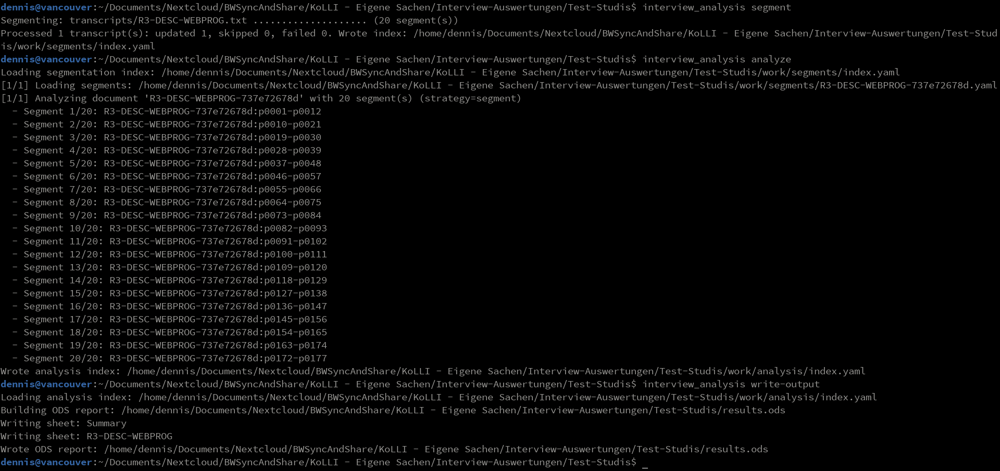
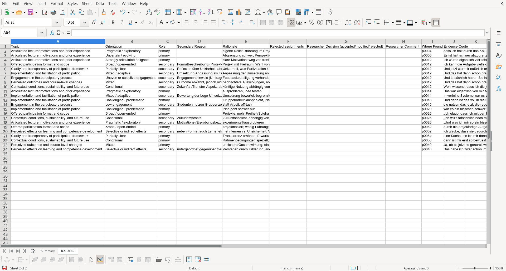

Interview Analysis
==================

1. [Overview](#overview)
1. [Methodological Notes](#methodological-notes)
1. [Important Commands](#important-commands)
1. [Start a New Coding Project](#start-a-new-coding-project)
1. [Transcript Format](#transcript-format)
1. [Configuration (interviews.yaml)](#configuration-interviewsyaml)
1. [Run a Full Analysis](#run-a-full-analysis)
1. [Cleaning the Work Directory](#cleaning-the-work-directory)
1. [Output File Contents](#output-file-contents)
1. [Copyright](#copyright)





Overview
--------

This project is a small CLI tool for **codebook-based qualitative content analysis** over
interview transcripts. The goal is to support a *structured, non-interpretive* coding workflow:
you define a codebook up front (topics and optional orientations), and the program applies that
codebook consistently across transcripts to produce an auditable evidence trail and simple
frequency summaries.

At a high level, the pipeline:

1. Reads interview transcripts (ODT, TXT, MD).
2. Normalizes speaker statements and assigns stable paragraph identifiers.
3. Splits transcripts into overlapping segments (for local context).
4. Uses an LLM to assign **topics** (categories) and optional **orientations** (subcategories)
	 to each statement, including a short evidence quote.
5. Produces an `.ods` spreadsheet with an aggregated summary and a per-transcript track record.

The workflow is configuration-driven via `interviews.yaml` and writes intermediate, inspectable
YAML work files (typically `work/segments/` and `work/analysis/`) to support reproducibility and
incremental re-runs.

Methodological Notes
--------------------

### Terminology

To make the outputs easier to interpret and cite, the tool uses the following terms:

* **Statement**: one speaker turn that begins with a label like `Name: ...`. In TXT/Markdown,
	unlabeled blocks are treated as continuations of the previous statement.
* **Paragraph identifier**: a stable ID of the form `p####` within a transcript, assigned after
	normalization (metadata lines are removed before numbering).
* **Segment**: a window of consecutive statements used as LLM context. Segments overlap so that
	statements near boundaries still have local context; overlap statements are marked as reference-only.
* **Topic**: a deductive code/category from the codebook (the primary unit counted in the summary).
* **Orientation**: an optional, topic-specific subcategory (e.g., positive/negative; clear/unclear)
	that refines a topic assignment.
* **Evidence quote**: a short excerpt recorded alongside a topic/orientation assignment to support
	auditability in the final spreadsheet.
* **Codebook**: the list of topics (and optional orientations/descriptions) defined in `interviews.yaml`.

### What kinds of analysis does this tool support?

This tool supports **deductive / framework-guided coding** where the codebook is specified
in advance. Practically, it implements *categorical assignment* of one or more topics per
statement, optionally enriched by an “orientation” dimension per topic.

Supported analysis outputs:

* **Per-statement categorical coding** (topic presence, and optionally topic-orientation).
* **Within-case audit trails** (chronological evidence per transcript).
* **Across-case frequency summaries** (counts by topic and topic-orientation, plus an example quote).

### Supported coding modes (LLM strategies)

The program provides two LLM calling strategies (see `analysis.strategy`):

* `segment`: one LLM call per segment with the full codebook.
	This is usually faster and cheaper for small-to-medium codebooks.
* `topic`: one LLM call per segment **per topic**.
	This can be more robust for large/ambiguous codebooks, at the cost of more API calls.

Additionally, each topic can optionally allow multiple orientations for the same statement
(`allow_multiple_orientations`). If multiple orientations are not allowed, the configured
orientation order is treated as a ranking (highest → lowest) and at most one is kept.

### Typical research scenarios

This workflow is a good fit when you want a **structured, comparable coding** across many
interviews, for example:

* Program / intervention evaluations (e.g., perceived benefits, barriers, implementation issues).
* Education research (e.g., attitudes toward a teaching method; uptake, workload, outcomes).
* Organizational studies (e.g., readiness for change, compliance concerns, resource constraints).
* Needs assessments (e.g., requested features, pain points, support requirements).

It is especially useful when your research question benefits from a **traceable evidence table**
and simple descriptive statistics (counts) rather than interpretive theme-building.

### What this tool does *not* do (and how to use it responsibly)

This tool is not a replacement for established qualitative methods that rely on interpretive,
iterative theme development. In particular, it does **not** implement:

* inductive thematic analysis / grounded theory coding workflows,
* conversation analysis / discourse analysis,
* qualitative memoing, coder adjudication workflows, or inter-rater reliability computation.

Because an LLM is used for coding, results should be treated as **assisted coding** and should be
validated by researchers (e.g., spot checks, review of the per-transcript evidence sheets, and
refinement of codebook definitions). The intermediate work files and the `.ods` track record are
intended to make such review feasible.

### LLM-assisted coding with retained human accountability

This tool is intended for a **computer-assisted first-cycle coding** workflow with **full auditability**.
It is *not* meant as an automated qualitative analysis pipeline.

In practice, the LLM acts as a **provisional first-cycle coder** under strict deductive constraints:

* The codebook (topics and optional orientations) is defined up front.
* The LLM proposes topic/orientation assignments for each statement and provides an evidence quote.
* The researcher then **reviews every assignment** and records the final decision.

Human accountability is retained by design:

* The `.ods` output includes two explicit review columns:
	- **Researcher decision (accepted/modified/rejected)**
	- **Researcher comment**
* LLM suggestions are **not removed** when rejected; the rejection is documented in these columns.
* The intermediate YAML work files and the per-transcript evidence sheets provide an audit trail of
	what the model suggested, where it was found, and what the researcher decided.

A suitable methodology description for a paper can be phrased along these lines:

> The language model was used to generate initial, deductive code assignments based strictly on a
> predefined codebook. All assignments were subsequently reviewed, corrected, or rejected by the
> researcher, who remained solely responsible for the final coding and interpretation.

This explicitly separates *pattern recognition* (LLM assistance) from *interpretive authority*
(researcher responsibility).

Example configuration for a conservative, revision-ready coding setup:

```yaml
analysis:
	# Strategy for LLM calls: segment or topic
	strategy: segment

	exclude_interviewer: true
	allow_secondary_assignments: false
	allow_multiple_primary_assignments: true

	# Procedural guidance for hybrid LLM–human coding
	llm_guidance:
		explain_assignments: true
		require_textual_evidence: true
		list_rejected_assignments: true
		default_to_conservative_orientation: true

	rules:
		- Code only statements made by students; ignore interviewer prompts, paraphrases, or confirmations.
		- Assign a topic only if the statement contains an explicit or clearly inferable evaluative judgment related to that topic.
		- Prefer the most specific topic available; do not assign multiple topics if one clearly dominates the meaning of the segment.
		- Base coding strictly on the expressed perception or experience of the student, not on assumed intentions of lecturers or researchers.
		- When orientations form an ordered scale, select the highest-ranked orientation only if it is explicitly and unambiguously supported by the statement.
		- Prefer lower-ranked or mixed orientations when statements are hedged, tentative, indirect, or internally inconsistent.
		- Do not resolve ambiguity through inference; preserve ambiguity in the coding where it exists in the data.
		- Absence of praise or critique must not be interpreted as balance or neutrality.
		- Do not infer outcomes, effects, or motivations that are not explicitly mentioned or strongly implied by the student.
		- If a statement references multiple examples with different valences, code according to the dominant emphasis expressed by the student.
		- Provide a brief keyword rationale and at least one piece of textual evidence for each assigned topic and orientation.
		- Explicitly list alternative topic/orientation candidates that were considered but rejected.
```

Important Commands
------------------

### Short version

* `poetry install`: install dependencies
* `poetry run interview_analysis --help`: show CLI help
* `poetry run interview_analysis template`: create a template `interviews.yaml`
* `poetry run interview_analysis segment`: generate segmentation work files
* `poetry run interview_analysis analyze`: run the LLM coding and write analysis work files
* `poetry run interview_analysis write-output`: generate the final `.ods` report
* `poetry run interview_analysis clean`: delete intermediate work files (with safety prompts)

### Poetry basics

This project uses [Poetry](https://python-poetry.org/) for dependency and virtual
environment management. The main project metadata lives in `pyproject.toml`.
Common commands:

| Command | Meaning |
|--------|---------|
| `poetry install` | Install dependencies from `pyproject.toml` |
| `poetry add xyz` | Add a dependency |
| `poetry remove xyz` | Remove a dependency |
| `poetry show --tree` | Show dependency tree |
| `poetry shell` | Open a shell with the venv activated |
| `poetry run …` | Run a command inside the venv |

The CLI entrypoint is registered in `[tool.poetry.scripts]` as `interview_analysis`, so you can run:

```sh
poetry run interview_analysis --help
```

### User-local shortcut (symlink into the Poetry venv)

If you want to run the CLI without typing `poetry run` every time, you can create a
user-local shortcut that points at the *current* Poetry virtualenv.

From the project root:

```sh
./update_local_bin.sh
```

This creates (or recreates) the symlink:

* `~/.local/bin/interview_analysis` → `<poetry-venv>/bin/interview_analysis`

Notes:

* If Poetry recreates the virtualenv (e.g. after dependency changes), the old symlink may become
	broken. Re-run `./update_local_bin.sh` to update it.
* If `~/.local/bin/interview_analysis` exists but is *not* a symlink, the script aborts to avoid
	overwriting anything.
* Ensure `~/.local/bin` is on your `PATH`.

### Other local install options

1) Editable install into your user site-packages (no isolation)

From the project root:

```sh
python -m pip install --user -e .
```

This creates the console script `interview_analysis` in `~/.local/bin` and links it to your current source
directory. Imports always resolve to your live code, and you typically don’t need `poetry run`.
Downside: dependencies are installed into your user site-packages, so there’s no isolation from
other `--user` installs.

2) Proper isolated user install (recommended for CLIs)

Use `pipx` to install the CLI in an isolated environment while still exposing the command
globally for your user:

```sh
pipx install .
```

This provides the `interview_analysis` command on your `PATH` (isolated from other Python projects). To update
after changes, re-run `pipx install --force .`.

Environment variables
---------------------

The tool loads environment variables via `python-dotenv`.
Copy `.env.template` to `.env` and adjust values for your OpenAI-compatible endpoint.

Supported variables (see [interview_analysis/ai_llm.py](interview_analysis/ai_llm.py)):

* `LLM_OPENAI_API_KEY` (required): API key for the endpoint
* `LLM_OPENAI_MODEL` (required): model identifier (must support structured outputs)
* `LLM_OPENAI_BASE_URL` (optional, preferred): base URL for the API (for the OpenAI SDK)
	- example: `https://api.openai.com/v1`
* `LLM_OPENAI_HOST` (required if `LLM_OPENAI_BASE_URL` is not set): hostname
	- example: `api.openai.com`
* `LLM_OPENAI_PATH` (optional, legacy): path used to derive the base URL
	- historically this may point to a full endpoint like `/v1/chat/completions`

Example:

```dotenv
LLM_OPENAI_BASE_URL=https://api.openai.com/v1
LLM_OPENAI_MODEL=gpt-5
LLM_OPENAI_API_KEY=...
```

Start a New Coding Project
--------------------------

1. Create a new directory for your coding project.
2. Create a template configuration:

	 ```sh
	 poetry run interview_analysis template
	 ```

	 This writes `./interviews.yaml`.
3. Create a transcript folder:

	 ```sh
	 mkdir -p transcripts
	 ```

4. Put your transcript files into `transcripts/` (`.odt`, `.txt`, or `.md`).
5. Edit `interviews.yaml`:
	 - set `include` to match your transcript files (e.g. `"transcripts/**/*"` or `"transcripts/**/*.{odt,txt,md}"`)
	 - adjust `topics` and their allowed `orientations`
	 - optionally tune `segmentation` and `analysis`

Transcript Format
-----------------

Transcripts can be **ODT**, **TXT**, or **Markdown** (`.md`) files.

ODT transcripts:

* Each statement is in its **own paragraph**.
* Each paragraph should start with a speaker label:

	```
	Name: What was said
	```

* Optional (recommended if you want to exclude interviewer statements): add exactly
	one metadata paragraph near the top of the document:

	```
	interviewer = Name1, Name2
	```

	You can also add additional metadata paragraphs in the same `key = value` form
	(e.g. `date = 2026-01-12`, `location = Campus`). These lines are removed from
	the transcript before segmentation and stored in the segment work file metadata.

	The program uses this to identify interviewer labels and can exclude their
	statements from coding when configured.

TXT/Markdown transcripts:

* Statements are separated by **at least one empty line**.
* Each statement should start with a label like `Name: ...`.
* If a block does *not* start with a label, it is treated as a continuation of
  the previous statement.
* Optional metadata block (recommended if you want to exclude interviewer statements):

	```
	interviewer = Name1, Name2
	```

	Additional `key = value` metadata blocks are supported as well.
	
* Lines/blocks at the beginning of the document that do not start with a speaker
	label are ignored until the first labeled statement (common for transcription
	software headers) — unless the line is a metadata line in `key = value` form.

	Place it as its own block (surrounded by empty lines), near the top.

Configuration (interviews.yaml)
-------------------------------

Required top-level options:

* `include` (string or list of strings): glob pattern(s) for transcripts to include
* `workdir` (string): work directory for intermediate files (e.g. `./work`)
* `outfile` (string): path to the final `.ods` report (e.g. `results.ods`)
* `topics` (list): a list of topic definitions (the codebook)

Optional top-level options:

* `exclude` (string or list of strings): glob pattern(s) to exclude files (e.g. `"private/**"`)

Optional sections:

### segmentation

* `segmentation.segment_paragraphs` (int, default: 12)
	- number of paragraphs per segment
* `segmentation.overlap_paragraphs` (int, default: 3)
	- number of paragraphs repeated from the previous segment (context only)

### analysis

* `analysis.exclude_interviewer` (bool, default: false)
	- if `true`, statements attributed to the interviewer are excluded from coding
	- requires an interviewer metadata paragraph in the transcript
* `analysis.strategy` (string, default: `segment`)
	- `segment`: one LLM call per segment with the full codebook
	- `topic`: one LLM call per segment per topic (more robust, more costly)

* `analysis.rules` (list of strings, optional)
	- additional global coding rules (short, explicit instructions) that are appended to the LLM prompt
	- use this to prevent systematic confusions that are not easily expressed as topic/orientation definitions

* `analysis.allow_secondary_assignments` (bool, default: false)
	- if `true`, the model may assign multiple topics to the same statement by marking one as `primary` and others as `secondary`
	- secondary assignments must include a short keyword note explaining why they are secondary
	- the `Summary` sheet counts primary assignments; secondary assignments are visible in the per-transcript sheets

* `analysis.allow_multiple_primary_assignments` (bool, default: true)
	- only relevant when `analysis.allow_secondary_assignments` is `true`
	- if `true`, the model may mark multiple topic matches as `primary` for the same statement (useful for very long statements)
	- if `false`, exactly one primary is kept per statement; additional primaries are downgraded to `secondary` with a keyword reason

* `analysis.llm_guidance` (mapping, optional)
	- optional flags to tune *how* the LLM explains and reports decisions
	- `explain_assignments` (bool, default: false): include a very short keyword-style rationale per accepted assignment
	- `require_textual_evidence` (bool, default: true): keep the strict “explicit textual evidence only” rule in the system prompt
	- `list_rejected_assignments` (bool, default: false): include a short list of considered-but-rejected assignments (topic/orientation only)
	- `default_to_conservative_orientation` (bool, default: true): when unsure, prefer the highest-ranked configured orientation (highest → lowest)

### topics (codebook)

Each entry in `topics` can be written in one of these formats:

1) Simple mapping (topic -> orientations):

	```yaml
	topics:
	  - My Topic: [Positive, Negative]
	```

2) Topic without orientations:

	```yaml
	topics:
	  - "My Topic"
	```

3) Expanded topic object with optional descriptions:

	```yaml
	topics:
	  - topic: "My Topic"
	    allow_multiple_orientations: false
	    description: "When to apply this topic"
	    orientations:
	      # When allow_multiple_orientations is false, list orientations from
	      # highest rank to lowest rank. If multiple orientations are returned
	      # anyway, the highest-ranked one is kept.
	      - "Positive"
	      - label: "Negative"
	        description: "Only if the statement explicitly expresses criticism"
	```

Notes:

* Orientation entries may be plain strings, or mappings with `label` and optional `description`.
* `allow_multiple_orientations` is optional per topic (default: `false`). If `false`, at most one orientation is kept per topic per statement, using the configured orientation order as ranking (highest → lowest). Extra orientations returned by the model are dropped.
* Changing `topics` (including descriptions) forces a re-run of `analyze` because the analysis work files store a `codebook_hash` for incremental change detection.

Run a Full Analysis
-------------------

Typical command sequence:

```sh
poetry run interview_analysis template
# edit interviews.yaml and place .odt transcripts in ./transcripts/

poetry run interview_analysis segment
poetry run interview_analysis analyze
poetry run interview_analysis write-output
```

Cleaning the Work Directory
---------------------------

The work directory contains intermediate YAML work files.
If the input transcripts change too much (e.g. paragraph ordering changes), or if
the program runs into errors and you want to restart from a clean state, you can
remove all intermediate files with:

```sh
poetry run interview_analysis clean
```

This command is safety-focused (prompts in an interactive terminal).

Output File Contents
--------------------

The output is an OpenDocument Spreadsheet (`.ods`) with:

* A `Summary` sheet: topic/orientation counts plus an example quote.
* One sheet per transcript: a chronological evidence track record with columns:
	- Topic
	- Orientation
	- Role (primary/secondary)
	- Secondary reason (keyword; only for secondary)
	- Rationale (short; optional)
	- Rejected assignments (short list; optional)
	- Researcher decision (accepted/modified/rejected)
	- Researcher comment
	- Where Found (paragraph identifier; transcript is implied by the sheet)
	- Evidence Quote

Copyright
---------

**Interview Analysis**  \
**© 2026 Dennis Schulmeister-Zimolong** <[dennis@wpvs.de](mailto:dennis@wpvs.de)>  \
Licensed under the BSD 3-Clause License (see `LICENSE`).

